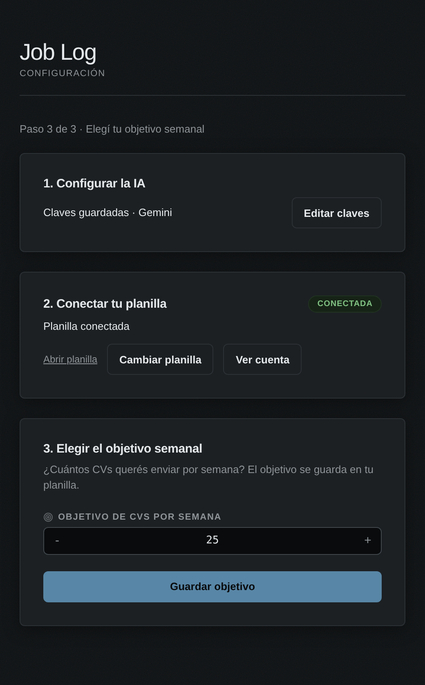

# Job Log: Extensión para registrar tus postulaciones

**Job Log** es una extensión gratuita y de código abierto para Chrome, Brave, Edge, Opera y Firefox de escritorio 140 o posterior. Registra tus postulaciones en una hoja de cálculo de Google Sheets. En LinkedIn intenta obtener el título y la empresa usando tu sesión iniciada. En otros portales de empleo usa **Gemini** o **Groq** para extraer la información del texto de la oferta: elegís cuál es la IA principal y la otra queda como respaldo.

La extensión funciona desde tu navegador y se conecta directamente con Google, LinkedIn y los proveedores de IA que configurás. Job Log no opera un servidor intermediario.

Para Gemini, usa `gemini-3.5-flash-lite` y, si necesita reintentar con otro modelo, `gemini-3.6-flash`. El modelo `gemini-3.5-flash` fue reemplazado; Flash-Lite sigue disponible. La disponibilidad y las cuotas dependen de tu cuenta de Google.

---

## Paso 0: Preparar la hoja de cálculo

Antes de instalar la extensión, creá tu copia de la planilla:

1. Abrí la [plantilla de Google Sheets de Job Log](https://docs.google.com/spreadsheets/d/1pmP8vlTjwJwgYJL89mQZGuCMvN2pDb6_9oSI4HjAvPo/template/preview).
2. Hacé clic en **"Utilizar plantilla"** (esquina superior derecha). Esto crea una copia limpia y privada en tu Google Drive.
3. Más adelante, elegí esa copia en el selector de Google desde la configuración de Job Log.

---

## Paso 1: Instalar la extensión

La publicación en Chrome Web Store está en preparación. Mientras tanto, podés probarla en modo desarrollador:

Para **Firefox**, seguí la [guía de instalación y uso](./FIREFOX.md). La instalación desde el repositorio es temporal y se elimina al cerrar Firefox. Los pasos siguientes son para Chrome y los navegadores compatibles con sus extensiones.

1. **Descargá el código:**
   - Con Git: `git clone https://github.com/eduardoemanuelcf/job-log.git`
   - Sin Git: hacé clic en **Code → Download ZIP** y extraé la carpeta donde quieras.

2. **Cargala en tu navegador:**
   - Abrí la página de extensiones de tu navegador:
     - Chrome: `chrome://extensions/`
     - Brave: `brave://extensions/`
     - Edge: `edge://extensions/`
   - Activá **"Modo de desarrollador"** (arriba a la derecha).
   - Hacé clic en **"Cargar descomprimida"** y seleccioná la carpeta del proyecto (la que tiene el archivo `manifest.json`).


---

## Paso 2: Configurar la extensión

### 2.1: Obtener tus API Keys (gratis)

* **Gemini API Key:**
  1. Entrá a [Google AI Studio](https://aistudio.google.com/app/apikey) e iniciá sesión con tu cuenta de Google.
  2. Hacé clic en **"Get API key"** → **"Create API key"**.
* **Groq API Key (opcional):**
  1. Entrá a [Groq Console](https://console.groq.com/keys).
  2. Creá una clave API si querés usar Groq como IA principal, o como respaldo ante caídas o límites de cuota en Gemini.


### 2.2: Cargar tus credenciales

1. Hacé clic en el ícono de la extensión en la barra de herramientas y presioná **Configuración** (o clic derecho → **Opciones**).
2. Completá los campos:
   - **IA principal:** elegí Gemini o Groq. La otra queda como respaldo si cargaste su clave.
   - **Gemini API Key:** pegá tu clave de Gemini.
   - **Groq API Key (opcional):** pegá tu clave de Groq si la tenés.
3. Aceptá el uso de datos y pulsá **Autorizar planilla** en **Cuenta de Google**. Elegí tu copia de la plantilla en el selector: Job Log la autoriza y guarda automáticamente, sin copiar ni pegar enlaces.
4. Hacé clic en **Guardar configuración** para aplicar las claves de IA, el proveedor y el objetivo semanal que ingresaste. La planilla autorizada ya queda guardada.

Después de autorizarla, el botón pasa a **Cambiar planilla** y permite elegir otra en Google, que también se guarda automáticamente. **Abrir planilla** abre la selección actual en Google Sheets.



---

## Paso 3: Usar la extensión

1. Abrí cualquier oferta de empleo en **LinkedIn** (u otro portal soportado).
2. Hacé clic en el ícono de **Job Log**.
3. Seleccioná la semana. Si querés, desplegá **Nota opcional** y escribí hasta 2.000 caracteres. Hacé clic en **Registrar postulación**.
4. Job Log extrae empresa, puesto, enlace y origen. Puede enviar el texto de la oferta a Gemini o Groq cuando necesita IA.
5. La fila se agrega a tu planilla con estado **En proceso** y la nota en la columna I, **Notas** (el encabezado debe estar en I2). Podés editar esos datos en Google Sheets. La nota no se envía a Gemini ni Groq.
6. Pulsá **Ver progreso** para consultar tus postulaciones y metas semanales. Usá **Anterior** y **Siguiente** para recorrer tu historial, o **Actualizar** para leer los cambios de tu planilla.

La última nota sin enviar se conserva al reabrir la misma oferta. Escribir en otra oferta reemplaza ese borrador; registrar la postulación o borrar el texto lo elimina.


---

## Actualizaciones

Las instalaciones desde Chrome Web Store o Firefox Add-ons recibirán las versiones publicadas mediante el sistema de actualización del navegador. Un push a GitHub no publica una versión en las tiendas.

Si instalaste desde el código, descargá la revisión que quieras y recargá la extensión en la página de extensiones del navegador. En Firefox, volvé a generar y cargar el paquete siguiendo [su guía](./FIREFOX.md).

## Preparar un paquete desde el código

Con Node.js y Python 3 instalados, ejecutá desde la carpeta del proyecto:

```bash
node scripts/check.cjs
python3 scripts/package.py --browser chrome
python3 scripts/package.py --browser firefox
```

Los paquetes quedan en `dist/`.

---

## Privacidad y seguridad

### ¿A qué archivos de Google puede acceder la extensión?

Job Log solicita `https://www.googleapis.com/auth/drive.file`: acceso a los archivos que autorizás para la app, en lugar de todas tus hojas de cálculo. Usa la planilla seleccionada para registrar postulaciones y consultar el progreso. La planilla se elige y autoriza en el selector de Google, y se guarda automáticamente. Podés revocar el permiso desde tu cuenta de Google.

Si usaste una versión anterior, volvé a autorizar tu planilla. Para comprobar que funciona sin el permiso amplio anterior, revocá primero el acceso de Job Log desde tu cuenta de Google y conectá nuevamente.

### Preparar OAuth para probar `drive.file`

En Google Cloud, habilitá **Google Sheets API** y **Google Picker API**, y agregá `https://www.googleapis.com/auth/drive.file` en **Google Auth Platform → Data Access**. La selección usa el Picker dentro del flujo OAuth, sin servidor ni clave API adicional: [documentación de Google](https://developers.google.com/workspace/drive/picker/guides/desktop-mobile-picker).

Para seguir el pedido de verificación, probá primero con otro proyecto. Actualizá los IDs de cliente en `manifest.json` y `oauth-config.js` con las credenciales de ese proyecto y registrá los redirects que usa `googleRedirectUri()` para cada navegador. En un proyecto en modo Testing, agregá tu cuenta como usuario de prueba. En el proyecto original, no elimines scopes previamente aprobados; retirás `spreadsheets` si no estaba aprobado una vez probada la migración.

### Arquitectura sin servidores

La extensión corre completamente en tu navegador. El flujo de datos es directo:

* **En LinkedIn:** el título y la empresa se obtienen de la API interna de LinkedIn (`https://www.linkedin.com/voyager/...`) usando tu sesión ya iniciada, y se guardan directamente en tu Google Sheets. Si no se pueden confirmar esos datos, puede usar la IA como respaldo.
* **En otros portales:** el texto de la oferta se envía a la IA que elegiste como principal (y a la otra como respaldo si falla) para estructurar los datos, que luego se guardan en tu Google Sheets.

Las claves API se envían al proveedor correspondiente para autenticar las solicitudes. Las preferencias y claves se guardan en el almacenamiento sincronizable del navegador. Pueden sincronizarse mediante Chrome Sync o Firefox Sync si habilitaste la sincronización de extensiones; no se transfieren automáticamente entre Brave y Firefox. El token de Google y el correo disponible se guardan localmente. Consultá la [política de privacidad](./PRIVACY.md).

### Código abierto

El código está disponible bajo la [licencia MIT](./LICENSE) para que puedas revisarlo, modificarlo y comprobar cómo se usan tus datos.
